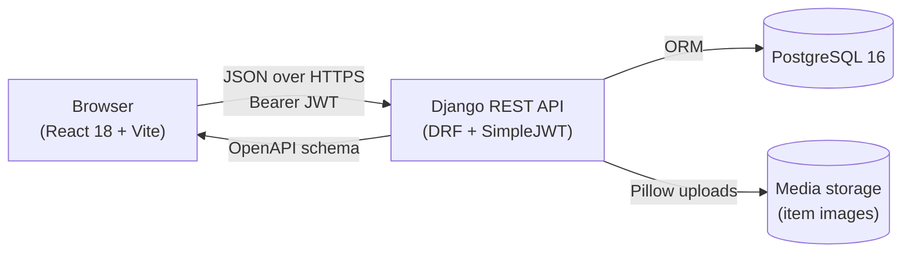

# PLMun Inventory Nexus

[](https://github.com/RICKTZY22/plmun-nexus-/actions/workflows/ci.yml)

A full-stack inventory and equipment-borrowing system for the Pamantasan ng Lungsod ng Muntinlupa, replacing paper-based borrow logs with a role-based digital workflow.

Built as a software engineering capstone for BSCS 3D (AY 2025–2026).

> **Live demo:** the Render deployment is currently offline (free plan not renewed). The project is fully re-deployable from [`render.yaml`](render.yaml); see [Deployment](#deployment) below. Until then, the system runs locally in a few minutes — instructions are in [Getting started](#getting-started).

---

## Highlights

- **JWT authentication** with a refresh-token mutex queue that coalesces concurrent 401 retries into a single refresh request.
- **4-role RBAC** (Student → Faculty → Staff → Admin) enforced at the API layer with DRF permission classes and mirrored in the UI via a `RoleGuard` component.
- **Atomic stock operations** using Django's `F()` expressions inside `select_for_update` transactions, preventing oversubscription when multiple staff approve requests for the same item simultaneously.
- **Full borrow lifecycle** modelled as an explicit state machine: `PENDING → APPROVED → COMPLETED → RETURNED`, with `REJECTED` and `CANCELLED` branches and audit logging on every transition.
- **Tamper-resistant audit trail** capturing 17 action types with IP address and user agent, queryable from the admin settings panel.
- **Per-user overdue flagging** with an idempotent scanner that runs on dashboard load and increments a `flagged_count` field per user — not per-request — to avoid double-counting.
- **OpenAPI documentation** auto-generated via `drf-spectacular`, served at `/api/schema/swagger-ui/`.

## Tech stack

**Backend**
- Django 6.0 + Django REST Framework 3.16
- SimpleJWT 5.5 for token auth
- PostgreSQL 16 (production) / SQLite (local)
- `drf-spectacular` for OpenAPI schema
- `django-ratelimit` on login and registration endpoints
- Gunicorn + WhiteNoise behind Render's static front

**Frontend**
- React 18 + Vite 5
- Zustand (auth + UI preferences, persisted to `localStorage`)
- Tailwind CSS with dark-mode class strategy
- Axios with response interceptors for token refresh
- Recharts for dashboard analytics
- `react-router-dom` v6 with role-aware route guards

**Tooling**
- ESLint (frontend), `coverage.py` (backend, planned)
- Vitest for frontend unit tests
- Django `TestCase` for backend tests
- GitHub Actions for CI

## Architecture



The frontend is a stateless SPA served as static files; all state lives in the API or in `localStorage`. Auth tokens are stored client-side; refresh is handled transparently via an Axios interceptor that queues concurrent 401 retries behind a single refresh call.

Deeper dives:
- [Backend architecture](docs/backend-documentation.md) — models, serializers, permissions, atomic operations
- [Frontend architecture](docs/frontend-documentation.md) — routing, state, axios interceptor, RoleGuard
- [Algorithms & complexity](docs/doc-6-algorithms-complexity.md) — stock concurrency, overdue scanner, refresh mutex
- [Testing, security, deployment](docs/doc-4-testing-security-deployment.md)

## Project structure

```
.
├── Backend/                  # Django project
│   ├── apps/
│   │   ├── authentication/   # Users, JWT, audit log
│   │   ├── inventory/        # Items, categories, stock
│   │   ├── requests/         # Borrow workflow, comments, notifications
│   │   └── users/            # Admin-only user management
│   ├── config/               # Django settings, URLs, WSGI
│   └── manage.py
├── frontend/
│   └── src/
│       ├── pages/            # Route components
│       ├── components/       # Reusable UI + feature components
│       ├── hooks/            # useInventory, useRequests, useNotifications, ...
│       ├── services/         # Axios API clients
│       └── stores/           # Zustand stores
├── docs/                     # Architecture and design documentation
├── .github/workflows/        # CI pipelines
└── render.yaml               # Render deployment blueprint
```

## Getting started

### Prerequisites

- Python 3.12+
- Node.js 20+
- PostgreSQL 16 (optional — SQLite works for local dev)

### Backend

```bash
cd Backend
python -m venv venv
# Windows
venv\Scripts\activate
# macOS/Linux
source venv/bin/activate

pip install -r requirements.txt
cp .env.example .env       # then edit SECRET_KEY, DATABASE_URL, etc.
python manage.py migrate
python manage.py createsuperuser
python manage.py runserver
```

The API is now at `http://localhost:8000/api/`. Browse the OpenAPI schema at `http://localhost:8000/api/schema/swagger-ui/`.

### Frontend

```bash
cd frontend
npm install
npm run dev
```

The app is at `http://localhost:5173/`. Vite proxies `/api` to the Django dev server.

### Demo data (optional)

To populate the database with realistic users, inventory, and historical requests:

```bash
cd Backend
python manage.py seed_demo
```

This creates four demo accounts — one per role — with the credentials printed to the console. Useful for exercising the dashboard without manually creating data.

By default, the demo users use `demo_pass_2026`. To surface those credentials as clickable shortcuts on the Login page (handy when sharing the deployment with reviewers), set `VITE_DEMO_MODE=true` in `frontend/.env`. Leave demo mode unset — or set to `false` — for any real deployment.

## Testing

```bash
# Backend
cd Backend
python manage.py test

# Frontend
cd frontend
npx vitest run
```

Test coverage is intentionally focused on the highest-risk surfaces: JWT issuance and refresh, role permission boundaries, the request state machine, and atomic stock deduction under concurrent approvals.

## Deployment

The repository ships with [`render.yaml`](render.yaml) — a Render Blueprint that provisions:

1. A managed PostgreSQL 16 database
2. The Django API as a web service (Gunicorn + WhiteNoise)
3. The React frontend as a static site

After connecting the repo to Render, set the two `sync: false` env vars manually:
- `CORS_ORIGINS` on the backend → the frontend's deployed URL
- `VITE_API_URL` on the frontend → the backend's `/api` URL

Migrations run automatically on every deploy via `Backend/build.sh`.

## License

This project is coursework. No formal license is granted; if you'd like to use any part of it commercially, please open an issue.
